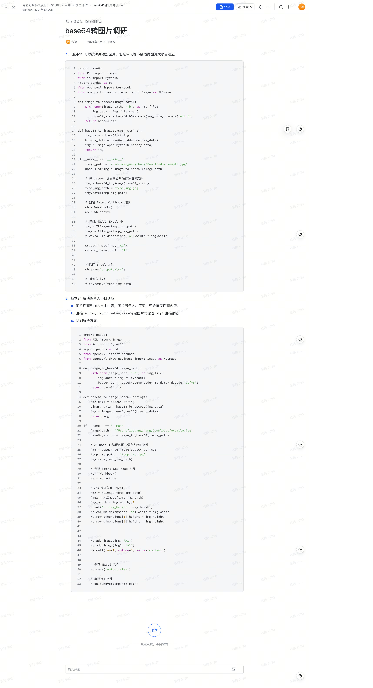

以下是您提供内容的 Markdown 转换结果：

# Base64 转图片调研

---

## 版本 1：按列添加图片，但单元格无法根据图片大小自适应

### 代码实现

```python
import base64
from PIL import Image
from io import BytesIO
from openpyxl import Workbook
from openpyxl.drawing.image import Image as XLImage

def image_to_base64(image_path):
    with open(image_path, 'rb') as img_file:
        img_data = img_file.read()
        base64_str = base64.b64encode(img_data).decode('utf-8')
    return base64_str

def base64_to_image(base64_string):
    binary_data = base64.b64decode(base64_string)
    img = Image.open(BytesIO(binary_data))
    return img

if __name__ == '__main__':
    image_path = '/Users/zeguangzhang/Downloads/example.jpg'
    base64_string = image_to_base64(image_path)

    # 将 Base64 编码的图片保存为临时文件
    img = base64_to_image(base64_string)
    temp_img_path = 'temp_img.jpg'
    img.save(temp_img_path)

    # 创建 Excel Workbook 对象
    wb = Workbook()
    ws = wb.active

    # 将图片插入到 Excel 中
    img = XLImage(temp_img_path)
    img2 = XLImage(temp_img_path)
    
    # 插入图片
    ws.add_image(img, 'A1')
    ws.add_image(img2, 'B1')

    # 保存 Excel 文件
    wb.save('output.xlsx')

    # 删除临时文件（注释掉以便调试）
    # os.remove(temp_img_path)
```

### 存在问题

1. 单元格无法根据图片大小自适应。
2. 图片只能按照列插入，若宽度或高度不匹配，可能导致排版混乱。

---

## 版本 2：解决图片大小自适应

### 优化内容

1. **调整单元格宽高以适应图片大小**：  
   - 使用 `ws.column_dimensions` 和 `ws.row_dimensions` 动态调整列宽和行高。
   
2. **问题排查与解决**：  
   - 图片覆盖文本内容问题：确保文本内容与图片不在同一单元格。  
   - `cell(row, column, value)` 无法直接传递图片对象：图片需通过 `add_image` 方法插入。

### 代码实现

```python
import base64
from PIL import Image
from io import BytesIO
from openpyxl import Workbook
from openpyxl.drawing.image import Image as XLImage

def image_to_base64(image_path):
    with open(image_path, 'rb') as img_file:
        img_data = img_file.read()
        base64_str = base64.b64encode(img_data).decode('utf-8')
    return base64_str

def base64_to_image(base64_string):
    binary_data = base64.b64decode(base64_string)
    img = Image.open(BytesIO(binary_data))
    return img

if __name__ == '__main__':
    image_path = '/Users/zeguangzhang/Downloads/example.jpg'
    base64_string = image_to_base64(image_path)

    # 将 Base64 编码的图片保存为临时文件
    img = base64_to_image(base64_string)
    temp_img_path = 'temp_img.jpg'
    img.save(temp_img_path)

    # 创建 Excel Workbook 对象
    wb = Workbook()
    ws = wb.active

    # 插入图片并设置单元格大小自适应
    img = XLImage(temp_img_path)
    img2 = XLImage(temp_img_path)

    img_width = img.width // 7  # 根据图片宽度动态设置列宽
    ws.column_dimensions['A'].width = img_width

    ws.row_dimensions[1].height = img.height  # 第一行高度
    ws.row_dimensions[2].height = img.height  # 第二行高度

    ws.add_image(img, 'A1')  # 插入到第一行第一列
    ws.add_image(img2, 'A2')  # 插入到第二行第一列

    ws.cell(row=1, column=3, value='content')  # 在第三列插入文本

    # 保存 Excel 文件
    wb.save('output.xlsx')

    # 删除临时文件（注释掉以便调试）
    # os.remove(temp_img_path)
```

### 优化后的效果

1. 图片宽度与单元格列宽匹配，图片不会因超出范围覆盖其他单元格。
2. 每张图片占用单独一行，图片高度自动调整行高。

---

## 总结

- **问题原因**：默认单元格无法自动调整宽高以适应图片大小。  
- **解决方案**：动态调整单元格宽高，并确保图片和文本不在同一单元格内。  
- **注意事项**：
  1. 动态计算宽高比例，确保图片与单元格匹配。
  2. 调试过程中可保留临时文件以检查效果。

原始文档截图：
