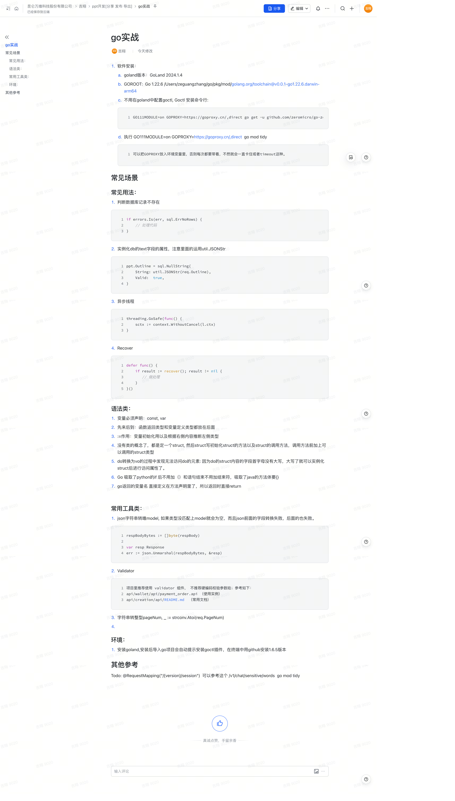

以下是您提供内容的 Markdown 转换结果：

# Go 实战

## 软件安装

1. **GoLand 版本**：  
   - GoLand 2024.1.4  

2. **GOROOT 配置**：  
   - Go 1.22.6  
   - 路径：`/Users/zeguangzhang/go/pkg/mod/golang.org/toolchain@v0.0.1-go1.22.6.darwin-arm64`  

3. **Goctl 安装**：  
   - 不需要在 GoLand 中配置 `goctl`，直接通过命令行安装：  
     ```bash
     GO111MODULE=on GOPROXY=https://goproxy.cn/,direct go get -u github.com/zeromicro/go-zero/tools/goctl
     ```

4. **执行 `go mod tidy`**：  
   - 使用命令：
     ```bash
     GO111MODULE=on GOPROXY=https://goproxy.cn/,direct go mod tidy
     ```
   - **建议**：将 `GOPROXY` 设置为环境变量，否则每次执行命令时都需要手动添加，避免出现卡住或超时的问题。

---

## 常见场景与用法

### 1. 判断数据库记录不存在
```go
if errors.Is(err, sql.ErrNoRows) {
    // 处理代码
}
```

### 2. 实例化 `db` 的 `text` 字段
- 注意使用 `util.JSONStr`：
```go
ppt.Outline = sql.NullString{
    String: util.JSONStr(req.Outline),
    Valid:  true,
}
```

### 3. 异步线程
```go
threading.GoSafe(func() {
    sctx := context.WithoutCancel(l.ctx)
})
```

### 4. Recover 错误捕获
```go
defer func() {
    if result := recover(); result != nil {
       // 做处理
    }
}()
```

---

## 语法类总结

1. **变量声明**：使用 `const` 和 `var`。
2. **顺序规则**：函数返回类型和变量定义类型都放在声明后面。
3. **`:=` 的作用**：  
   - 用于变量初始化，并根据右侧内容推断左侧类型。
4. **类与结构体**：  
   - Go 中没有类的概念，使用 `struct`。
   - 在 `struct` 内部定义方法，并通过类型前缀调用。
5. **访问限制**：  
   - 如果 `struct` 的字段首字母小写，无法外部访问。
   - 字段首字母大写后即可访问。
6. **语法灵感**：  
   - 类似 Python 的 `if` 条件无需括号，且语句结束无需分号。
   - 类似 Java，方法体需要用 `{}` 包裹。
7. **返回值声明**：  
   - 方法内可直接在声明时定义返回值，返回时直接使用 `return` 即可。

---

## 常用工具类

1. **JSON 转 Model**：
   - 如果 JSON 的字段类型无法匹配 Model，会导致字段解析失败，且后续字段也会解析失败。
   ```go
   respBodyBytes := []byte(respBody)

   var resp Response
   err := json.Unmarshal(respBodyBytes, &resp)
   ```

2. **参数校验工具**：
   - 推荐使用 `validator` 组件，不建议硬编码校验参数。  
   - **参考实例**：
     - `api/wallet/api/payment_order.api`
   - **常用文档**：
     - `api/creation/api/README.md`

3. **字符串转整型**：
   ```go
   pageNum, _ := strconv.Atoi(req.PageNum)
   ```

---

## 环境配置

1. 安装 GoLand 后，导入 Go 项目时会提示安装 `goctl` 插件。
2. 在终端中使用 GitHub 安装 `goctl` 的 1.6.5 版本。

---

## 其他参考

- **待办事项**：
  - 示例：
    ```text
    @RequestMapping("/{version}/session")
    ```
  - 可参考路径：`/v1/chat/sensitive/words`

- **运行命令**：
  ```bash
  go mod tidy
  ```

原始文档截图：
