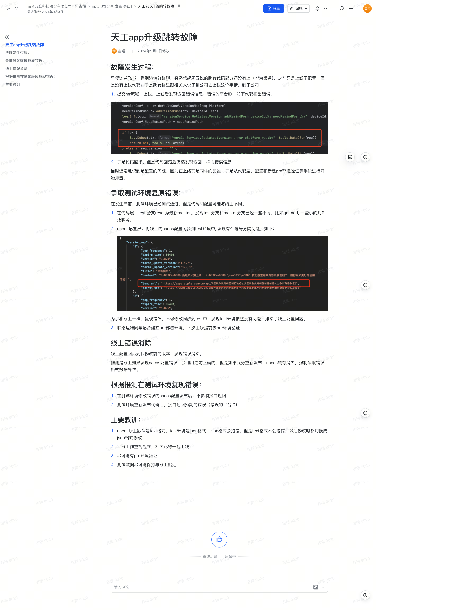

以下是您提供内容的 Markdown 转换结果：

# 天工 App 升级跳转故障

## 故障发生过程

早餐时浏览飞书，看到跳转群群聊，突然想起周五提到的跳转代码部分（华为渠道）还没有上线。此前仅上线了配置，但代码并未上线。于是，我在群里联系相关同事，计划到公司完成上线工作。

到公司后执行以下步骤：

1. **提交 MR 流程并上线**：
   - 上线后发现返回错误信息：**错误的平台 ID**。
   - 错误代码位置如下：
     - [代码报错截图]

2. **代码回滚**：
   - 回滚代码后，发现错误信息依然存在，返回结果与未回滚时一致。

由于上线前配置是相同的，因此未意识到是配置问题。排查从代码层、配置层及新建预环境验证开始。

---

## 测试环境复原错误

在生产环境出问题前，测试环境已经通过测试，但测试环境的代码和配置可能与线上存在差异。逐步排查如下：

### 1. **代码层排查**：
   - 将测试分支 `test` 的代码 `reset` 为最新的 `master`。
   - 发现 `test` 分支与 `master` 分支存在差异，例如：
     - `go.mod` 文件。
     - 一些小的判断逻辑。

### 2. **Nacos 配置层排查**：
   - 将线上 Nacos 配置同步到测试环境，发现如下问题：
     - 配置中存在逗号分隔的格式错误：
       - [截图示例]
   - 为了复现错误，不修改配置，直接同步到测试环境。
   - 测试环境依然没有问题，排除了线上配置问题的可能性。

### 3. **新建 Pre 部署环境**：
   - 联络运维同事配合，建立 Pre 部署环境。
   - 下次上线前提前在 Pre 环境验证，确保问题不会发生。

---

## 线上错误消除

- **配置回滚**：
  - 将线上配置回滚到我修改前的版本，错误消除。

- **推测原因**：
  - 如果线上 Nacos 配置存在格式错误，服务在运行时会使用之前的正确配置。
  - 如果服务重新发布，Nacos 缓存会消失，导致强制读取错误格式数据，引发问题。

---

## 测试环境复现错误

根据推测，在测试环境尝试复现错误：

1. 修改错误的 Nacos 配置并发布：
   - 接口返回未受影响。

2. 重新发布代码后：
   - 接口返回预期的错误（**错误的平台 ID**）。

---

## 主要教训

1. **Nacos 配置格式差异**：
   - 线上配置默认为 Text 格式，测试环境使用 JSON 格式。
   - JSON 格式会校验报错，而 Text 格式不会。
   - **教训**：修改配置时统一切换为 JSON 格式，以便更早发现问题。

2. **重视上线工作**：
   - 配置与代码相关的内容需同步上线，避免单独上线引发问题。

3. **尽可能验证 Pre 环境**：
   - 确保生产环境前在 Pre 环境中提前验证上线流程。

4. **测试数据贴近线上环境**：
   - 测试数据尽量与线上一致，以便快速复现潜在问题。
  

原始文档截图：

