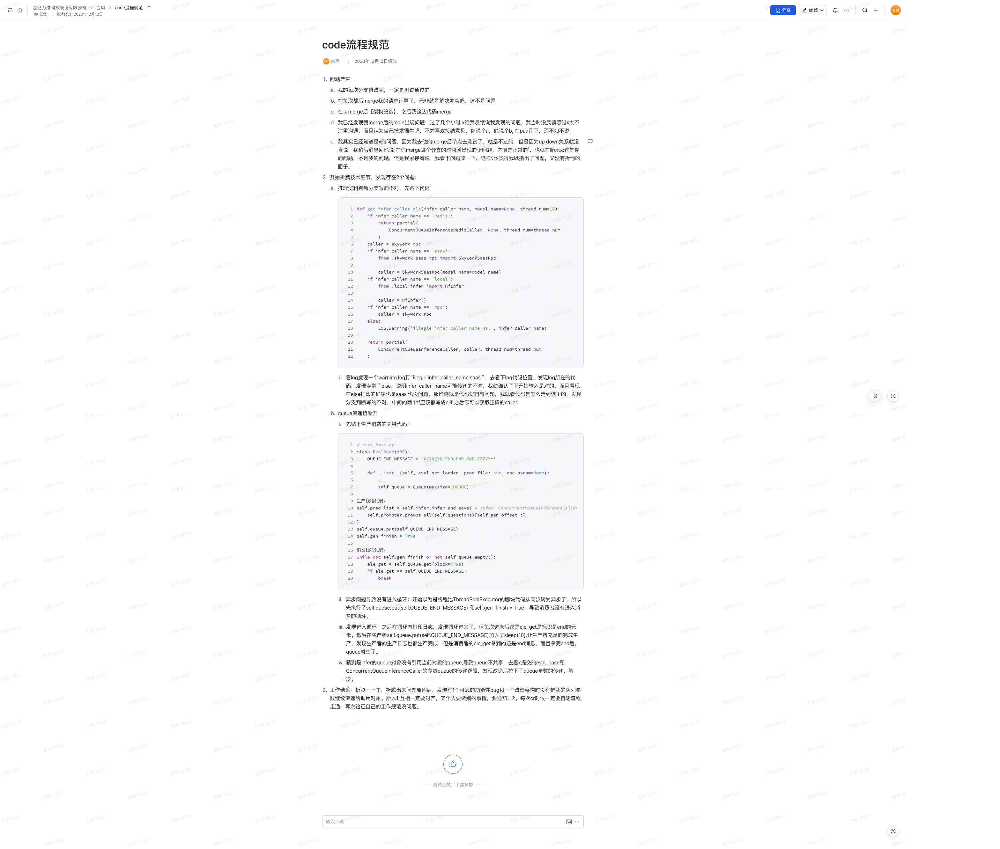

以下是将您提供的飞书文档内容转换成 Markdown 格式的结果：

# Code流程规范

## 1. 问题产生

1. 我的每次分支修改完，一定是测试通过的。
2. 在每次 merge 我的请求后，主要是解决冲突，这不是问题。
3. 在 X merge 后【架构改造】，之后我这边代码 merge。
4. 我已经发现我 merge 后的 main 出现问题，过了几个小时 X 给我反馈说他也发现了问题。我当时没反馈，觉得 X 太不注重沟通，而且认为自己技术很牛吧，不太喜欢接纳意见。你说个 A，他说个 B，还 PUA 几下，还不如不说。
5. 我其实已经知道是 X 的问题，因为我去他的 merge 后节点测试了，就是不过的。但因为上下级关系没直说，我稍后消息回他说：**“在你 merge 哪个分支的时候就出现的该问题，之前是正常的。”** 也就在暗示 X：这是你的问题，不是我的问题。但我紧接着说：**“我看下问题改一下。”** 这样让 X 觉得我既指出了问题，又没有折他的面子。

## 2. 开始折腾技术细节，发现存在 2 个问题：

### 2.1 推理逻辑判断分支写的不对

先贴下代码：

```python
def get_infer_caller_cls(infer_caller_name, model_name=None, thread_num=16):
    if infer_caller_name == 'redis':
        return partial(
            ConcurrentQueueInferenceRedisCaller, None, thread_num=thread_num
        )
    caller = skywork_rpc
    if infer_caller_name == 'saas':
        from .skywork_saas_rpc import SkyworkSaasRpc

        caller = SkyworkSaasRpc(model_name=model_name)
    if infer_caller_name == 'local':
        from .local_infer import HfInfer

        caller = HfInfer()
    if infer_caller_name == 'rpc':
        caller = skywork_rpc
    else:
        LOG.warning('illegle infer_caller_name %s.', infer_caller_name)

    return partial(
        ConcurrentQueueInferenceCaller, caller, thread_num=thread_num
    )
```

#### 问题分析：

1. 看 log 发现一个 warning log 打出了 **“illegle infer_caller_name saas.”**。
2. 去 log 代码位置，发现走到了 `else` 分支，说明 `infer_caller_name` 可能传递的不对。我确认了输入是对的，而且 `else` 打印的确实也是 `saas`，没问题。
3. 推测代码逻辑有问题，查看代码发现分支判断写的不对，中间的两个 `if` 应该写成 `elif`。修正后即可正确获取 `caller`。

---

### 2.2 queue 传递链断开

#### 关键代码

**生产线程代码：**

```python
self.pred_list = self.infer.infer_and_save( # infer：ConcurrentQueueInferenceCaller 含有线程池逻辑
    self.prompter.prompt_all(self.questions)[self.gen_offset :]
)
self.queue.put(self.QUEUE_END_MESSAGE)
self.gen_finish = True
```

**消费线程代码：**

```python
while not self.gen_finish or not self.queue.empty():
    ele_get = self.queue.get(block=True)
    if ele_get == self.QUEUE_END_MESSAGE:
        break
```

#### 问题分析

1. **异步问题导致没有进入循环**  
   开始以为是 `ThreadPoolExecutor` 的某部分从同步转为异步，导致 `self.queue.put(self.QUEUE_END_MESSAGE)` 和 `self.gen_finish = True` 提前执行，消费者没进入循环。

2. **发现进入循环**  
   在循环内打印日志发现循环进来了，但每次都是 `ele_get` 取到的元素是 `end` 标识。加入 `sleep(10)` 后发现生产者日志正常完成，但消费者仍然只获取到 `end` 消息。

3. **推测问题原因**  
   发现 `infer` 的 `queue` 对象没有引用当前对象的 `queue`，导致 `queue` 不共享。查看 X 提交的 `eval_base` 和 `ConcurrentQueueInferenceCaller` 的参数 `queue` 传递逻辑，发现改造时漏掉了 `queue` 参数的传递。修正后问题解决。

---

## 3. 工作结论

折腾了一上午，发现：

1. 一个功能性 bug：改造架构时未将队列参数继续传递给调用对象。
2. 工作建议：
   - **互相对齐**：某人要做其他事情时，需及时通知。
   - **代码评审（CR）时一定要自测流程走通**，确保自己的工作规范没问题。

原始文档截图：
