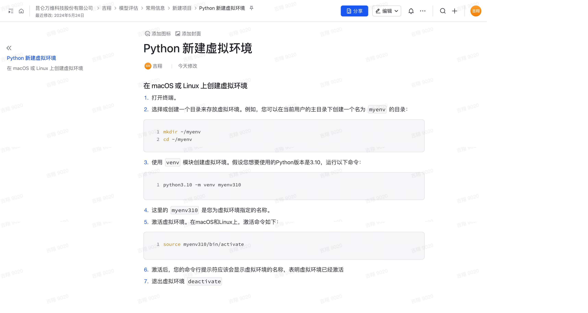

Python 新建虚拟环境
在 macOS 或 Linux 上创建虚拟环境
1. 打开终端。
2. 选择或创建一个目录来存放虚拟环境。例如，您可以在当前用户的主目录下创建一个名为 myenv 的目录：
mkdir ~/myenv
cd ~/myenv
3. 使用 venv 模块创建虚拟环境。假设您想要使用的Python版本是3.10，运行以下命令：
python3.10 -m venv myenv310
4. 这里的 myenv310 是您为虚拟环境指定的名称。
5. 激活虚拟环境。在macOS和Linux上，激活命令如下：
source myenv310/bin/activate
6. 激活后，您的命令行提示符应该会显示虚拟环境的名称，表明虚拟环境已经激活
7. 退出虚拟环境 deactivate

原始文档截图：
