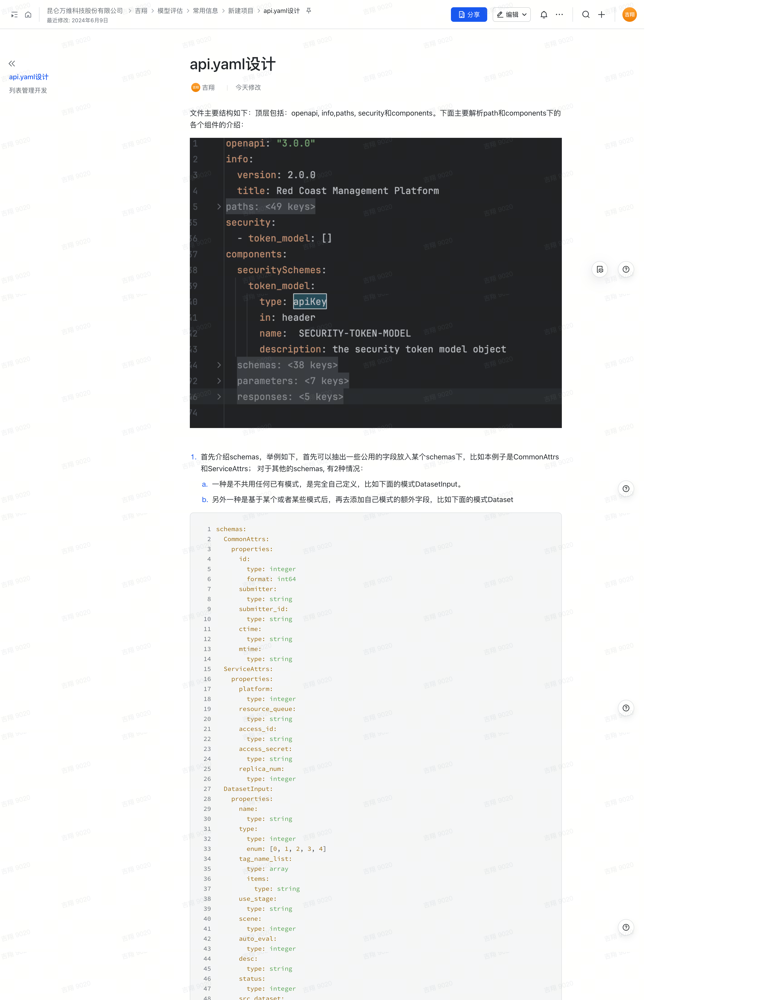

api.yaml设计
文件主要结构如下：顶层包括：openapi, info,paths, security和components。下面主要解析path和components下的各个组件的介绍：
[图片]

1. 首先介绍schemas，举例如下，首先可以抽出一些公用的字段放入某个schemas下，比如本例子是CommonAttrs和ServiceAttrs； 对于其他的schemas, 有2种情况：
  1. 一种是不共用任何已有模式，是完全自己定义，比如下面的模式DatasetInput。
  2. 另外一种是基于某个或者某些模式后，再去添加自己模式的额外字段，比如下面的模式Dataset
```
schemas:
  CommonAttrs:
    properties:
      id:
        type: integer
        format: int64
      submitter:
        type: string
      submitter_id:
        type: string
      ctime:
        type: string
      mtime:
        type: string
  ServiceAttrs:
    properties:
      platform:
        type: integer
      resource_queue:
        type: string
      access_id:
        type: string
      access_secret:
        type: string
      replica_num:
        type: integer
  DatasetInput:
    properties:
      name:
        type: string
      type:
        type: integer
        enum: [0, 1, 2, 3, 4]
      tag_name_list:
        type: array
        items:
          type: string
      use_stage:
        type: string
      scene:
        type: integer
      auto_eval:
        type: integer
      desc:
        type: string
      status:
        type: integer
      src_dataset:
        type: integer
      src_model:
        type: integer
      schema_name:
        type: string
      default_eval_config:
        type: string
      src_labeling_dataset:
        type: integer
  Dataset:
    allOf:
    - $ref: "#/components/schemas/DatasetInput"
    - $ref: "#/components/schemas/CommonAttrs"
    - type: object
      properties:
        file:
          type: string
        scene_name:
          type: string
```
1. 其次我们介绍parameters， 例如我们把一些公用的参数放在parameters里，虽然只是举例，但是下面的参数基本所有系统共用，可以直接套用：
```
parameters:
  pageNumParam:
    name: pn
    in: query
    required: false
    schema:
      type: integer
      title: Page Number
      description: the current page(default 0)
  pageSizeParam:
    name: rn
    in: query
    required: false
    schema:
      type: integer
      title: Page Size
      description: How many items to return at one page
  name:
    name: name
    in: query
    required: false
    schema:
      type: string
      description: name for fuzzy query
  idList:
    name: id_list
    in: query
    required: false
    schema:
      type: array
      items:
        type: integer
      description: the id of query target
  submitter:
    name: submitter
    in: query
    required: false
    schema:
      type: string
      description: submitter for fuzzy query
  startDate:
    name: start_date
    in: query
    required: false
    schema:
      type: string
      description: start mtime of query target
  endDate:
    name: end_date
    in: query
    required: false
    schema:
      type: string
      description: end mtime of query target
```
列表管理开发
1. 增加orm
2. 列表list
api.yaml: 把增删改查一起写了
```
/model-set:
  get:
    summary: List all modelSet
    description: List all modelSet
    operationId: modelSetList
    tags:
      - modelSet
    parameters:
      - $ref: "#/components/parameters/pageNumParam"
      - $ref: "#/components/parameters/pageSizeParam"
      - $ref: "#/components/parameters/name"
      - $ref: "#/components/parameters/idList"
      - $ref: "#/components/parameters/submitter"
      - $ref: "#/components/parameters/startDate"
      - $ref: "#/components/parameters/endDate"
      - name: parent_id_list
        in: query
        description: parent id list
        schema:
          type: array
          items:
            type: integer

    responses:
      '200':
        $ref: "#/components/responses/PagedListResponse"
  post:
    summary: add a modelSet
    description: add a modelSet
    operationId: modelSetAdd
    tags:
      - modelSet
    requestBody:
      description: JSON object for request body
      content:
        application/json:
          schema:
            $ref: "#/components/schemas/ModelSetInput"
    responses:
      '200':
        description: Expected response to a valid request
        content:
          application/json:
            schema:
              $ref: "#/components/schemas/ModelSet"
      '500':
        $ref: "#/components/responses/GenericServerError"
  put:
    summary: Update a modelSet
    description: Update a modelSet
    operationId: modelSetUpdate
    tags:
      - modelSet
    requestBody:
      description: JSON object for request body
      content:
        application/json:
          schema:
            $ref: "#/components/schemas/ModelSetInput"
    responses:
      '200':
        description: Success
        content: {}
      '304':
        description: Success
        content: {}
      '404':
        description: Not Found.
        content:
          application/json:
            schema:
              $ref: "#/components/schemas/Error"
  delete:
    summary: Delete a modelSet
    description: Delete a modelSet
    operationId: modelSetDelete
    tags:
      - modelSet
    parameters:
      - name: id
        in: query
        description: the id of modelSet
        required: true
        schema:
          type: integer
          format: int64
    responses:
      '200':
        description: Success
        content: {}
      '304':
        description: Success
        content: {}
      '404':
        description: Fail
        content: {}
        
        
$ref: "#/components/responses/PagedListResponse":     
responses:
  PagedListResponse:
    description: A paged array of one model
    content:
      application/json:
        schema:
          $ref: "#/components/schemas/PagedList"
          
$ref: "#/components/schemas/PagedList":
PagedList:
  required: [item_type, list, count]
  properties:
    item_type:
      type: string
      title: ItemType
    list:
      type: array
      items:
        oneOf:
          - $ref: '#/components/schemas/Dataset'    #上面具体有举例了
          - $ref: '#/components/schemas/ModelSet'
          - $ref: '#/components/schemas/Assessment'
          - $ref: "#/components/schemas/Module"
          - $ref: "#/components/schemas/Experiment"
          - $ref: '#/components/schemas/AssessmentTask'
          - $ref: '#/components/schemas/AssessmentSubtask'
          - $ref: "#/components/schemas/User"
          - $ref: "#/components/schemas/UserGroup"
          - $ref: "#/components/schemas/Role"
          - $ref: "#/components/schemas/GpuQueue"
          - $ref: '#/components/schemas/ApiCredential'
          - $ref: "#/components/schemas/LabelingDataset"
          - $ref: "#/components/schemas/DatasetTag"
      title: PagedListItem
    count:
      type: integer
      title: Count
```
3. 列表增加
4. 列表删除
5. 列表编辑

原始文档截图 截图工具有bug,这个不能截取全部：
