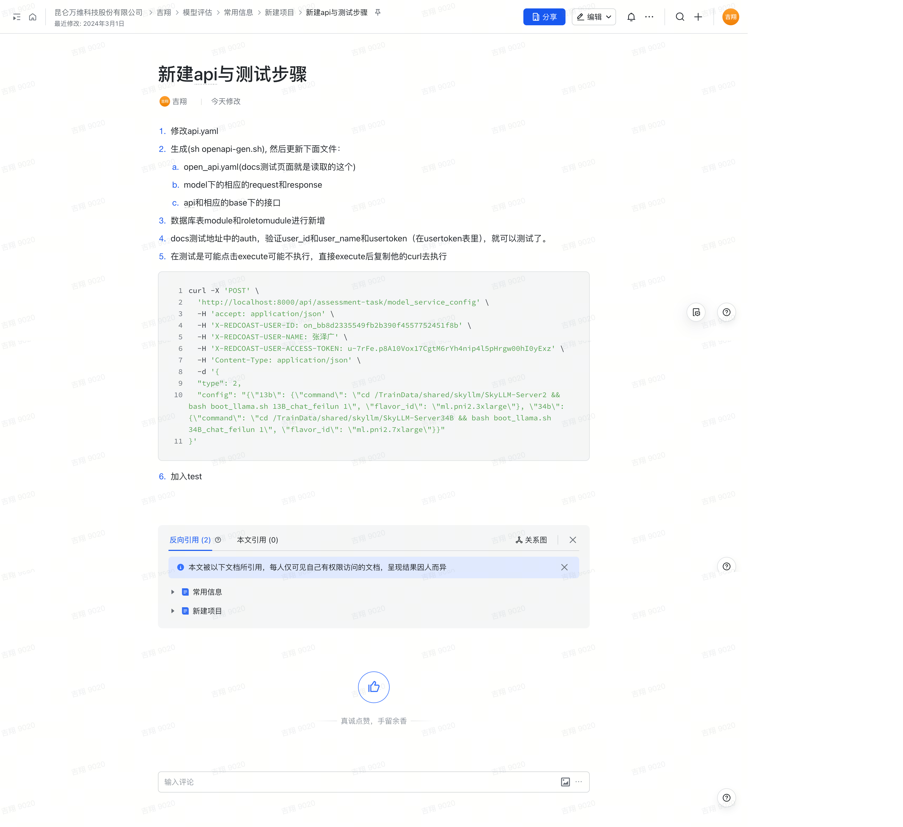

## 项目开发流程

1. **修改`api.yaml`**  
   - 根据需求修改`api.yaml`文件，更新接口定义和相关文档。

2. **生成代码并更新相关文件**  
   - 执行命令生成代码：  
     ```bash
     sh openapi-gen.sh
     ```
   - 更新以下文件：
     - `open_api.yaml`（docs测试页面读取此文件）
     - `model`下相应的`request`和`response`模型
     - `api`和相应`base`下的接口

3. **数据库表更新**  
   - 在数据库中新增`module`和`roletomodule`表，确保数据表结构符合新的需求。

4. **验证测试权限**  
   - 在`docs`测试页面的`auth`部分，验证`user_id`、`user_name`以及`usertoken`（在`usertoken`表中查询）。验证通过后即可进行测试。

5. **测试时执行问题处理**  
   - 在测试过程中，若点击`execute`按钮无法执行，可以复制`curl`命令直接执行：
     ```bash
     curl -X 'POST' \
       'http://localhost:8000/api/assessment-task/model_service_config' \
       -H 'accept: application/json' \
       -H 'X-REDCOAST-USER-ID: on_bb8d2335549fb2b390f4557752451f8b' \
       -H 'X-REDCOAST-USER-NAME: 张泽广' \
       -H 'X-REDCOAST-USER-ACCESS-TOKEN: u-7rFe.p8A10Vox17CgtM6rYh4nip4l5pHrgw00hI0yExz' \
       -H 'Content-Type: application/json' \
       -d '{
       "type": 2,
       "config": "{\"13b\": {\"command\": \"cd /TrainData/shared/skyllm/SkyLLM-Server2 && bash boot_llama.sh 13B_chat_feilun 1\", \"flavor_id\": \"ml.pni2.3xlarge\"}, \"34b\": {\"command\": \"cd /TrainData/shared/skyllm/SkyLLM-Server34B && bash boot_llama.sh 34B_chat_feilun 1\", \"flavor_id\": \"ml.pni2.7xlarge\"}}"
     }'
     ```

6. **加入单元测试**  
   - 在接口和功能实现后，编写相应的单元测试，确保接口的功能和数据正确性。


原始文档截图：
