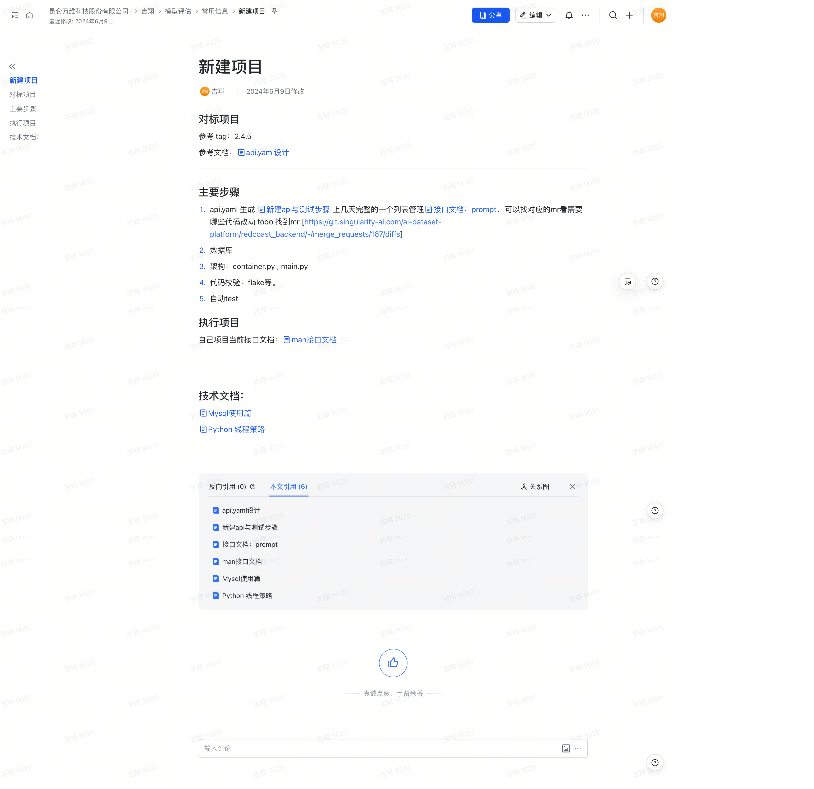

## 新建项目

### 对标项目  
参考 tag：2.4.5  
参考文档：`api.yaml`设计  

---

### 主要步骤

1. **API.yaml 生成**  
   - 新建API与测试步骤  
   - 参考上几天完整的接口文档管理：prompt。  
   - 可以查看对应的MR，查看需要哪些代码改动。  
   - **Todo**：找到MR [链接](https://git.singularity-ai.com/ai-dataset-platform/redcoast_backend/-/merge_requests/167/diffs)

2. **数据库**  
   - 设计数据库结构和表，确保与API文档匹配。

3. **架构**  
   - 配置架构：`container.py`, `main.py`

4. **代码校验**  
   - 使用 `flake8` 等工具进行代码质量校验，确保代码规范。

5. **自动化测试**  
   - 编写自动化测试脚本，确保项目的接口和功能正确。

---

### 执行项目

- 当前项目接口文档：`man`接口文档。

---

### 技术文档

- **MySQL使用篇**  
  - 提供有关MySQL配置、操作和优化的详细指南。

- **Python线程策略**  
  - 讲解在Python中如何有效使用线程池，避免线程问题，提高并发性能。

原始文档截图：
