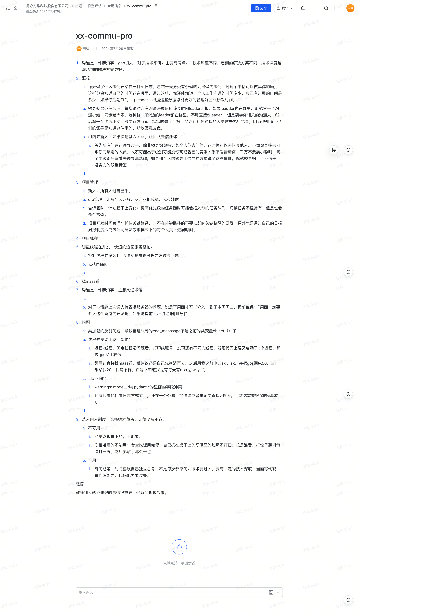

## xx-commu-pro

1. **沟通是一件麻烦事**  
   - **问题**：沟通存在很大的差距。对于技术来讲，主要有两个方面：  
     1. **技术深度不同**：不同的技术深度会导致想到的解决方案不同。技术深度越深，想到的解决方案往往越好。

2. **汇报**  
   1. **每天总结日志**：每一天做的事情要给自己打印日志，总结一天工作，分类有条理地列出做的事情，并为每个事情写具体的日志。这样你能了解时间的花费和工作进展，能更好地管理团队研发时间。  
   2. **任务进展汇报**：领导交给任务后，每次沟通进展后应该及时向领导汇报。如果领导也在群里，不需要直接@领导，但可以写一个沟通小结，@相关沟通人员并同步给大家。这样既向领导做了汇报，又能让对接的人愿意执行结果，因为他们知道领导关注这件事。  
   3. **新人的融入**：组内新人的融入，快速赢得团队的信任。  
      - 所有问题应先让领导过手，除非领导指派了某人给你解答。避免直接询问同级别人员，这可能会因为级别或者竞争关系影响沟通效果，导致信任危机。  
   4. **项目管理**  
      1. **新人管理**：所有新人要由自己过手。  
      2. **OFO管理**：让两个人既是竞争又是合作的关系，互相成就（例如与婧琳的合作）。  
      3. **任务计划与变化**：告知团队计划赶不上变化，更高优先级任务可能会插入，任务切换虽然不常见，但也会是常态。  
      4. **开发时间管理**：关注关键路径，不影响关键路径的研发。通过日报和周报，探索团队研发效率和每个人的进展时间。

3. **项目线程管理**  
   - **线程并发问题**：  
     1. 控制线程并发为1，观察排除线程并发过高问题。  
     2. 查找问题，向maas请教。

4. **沟通术语**  
   - 沟通需要技巧，例如对潘森关于香港服务器支持的问题提前催促：“周四一定要介入这个香港的开发啊，如果能提前也不介意啊[呲牙]”。

5. **技术问题**  
   1. **类加载的反射问题**：导致塞进队列的 `end_message` 不再是之前的类变量对象。  
   2. **线程并发调用返回繁忙**：  
      1. 确定线程没问题后，打印线程号，发现代码层启动了三个进程，QPS较低。  
      2. 在领导建议下，我申请了ak、sk，将QPS调整为50，展示出我的实际需求，领导开始理解我的工作负担。  
   3. **日志问题**：  
      1. **警告信息**：`model_id`与Pydantic字段冲突。  
      2. **日志查看方式**：他们依然采用逐行查看日志的方式，推荐使用过滤器或重定向配合vi搜索来提高效率（需要一定的vi基本功）。

6. **选人用人制度**  
   - **选择标准**：选择德才兼备的人员，无德者坚决不选。  
     1. **不可用**：  
        - 经常吃饭剩菜剩饭，不打扫；  
        - 吃相不雅，浪费食物，打饺子蘸料浪费过多。  
     2. **可用**：  
        - 第一时间独立思考解决问题，不依赖于提问；  
        - 技术能力过关，能够独立写代码，看代码能力强。

7. **感悟**  
   - 鼓励别人时要让他们感到所做的事情很重要，这样他们会更加积极。
  
原始文档截图：
