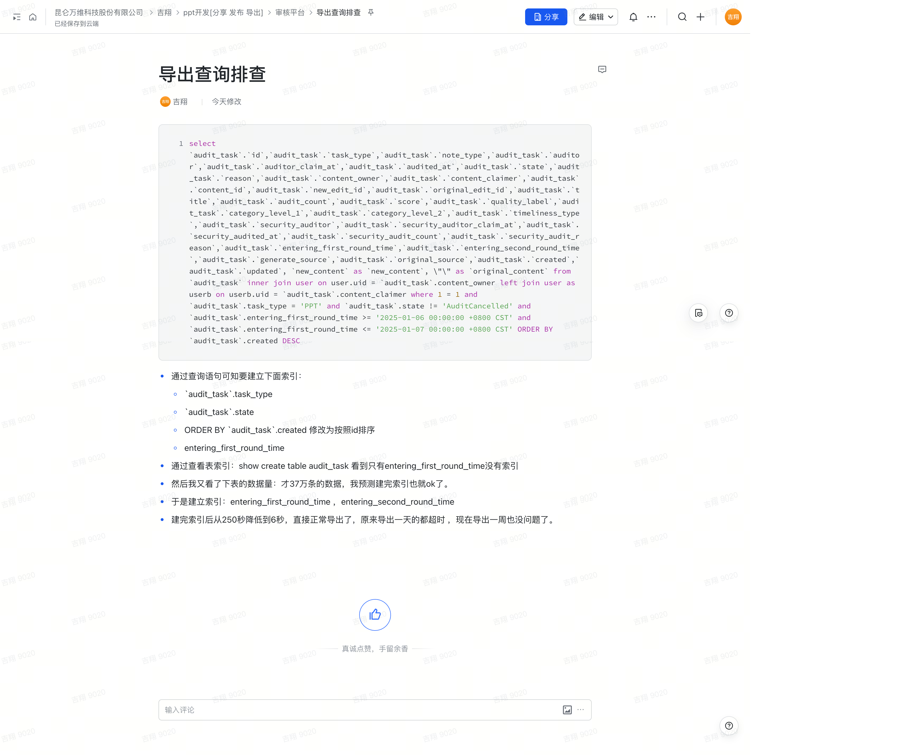

以下是您提供内容的 Markdown 转换结果：

# 导出超时排查

## 查询语句

```sql
SELECT 
  `audit_task`.`id`,
  `audit_task`.`task_type`,
  `audit_task`.`note_type`,
  `audit_task`.`auditor`,
  `audit_task`.`auditor_claim_at`,
  `audit_task`.`audited_at`,
  `audit_task`.`state`,
  `audit_task`.`reason`,
  `audit_task`.`content_owner`,
  `audit_task`.`content_claimer`,
  `audit_task`.`content_id`,
  `audit_task`.`new_edit_id`,
  `audit_task`.`original_edit_id`,
  `audit_task`.`title`,
  `audit_task`.`audit_count`,
  `audit_task`.`score`,
  `audit_task`.`quality_label`,
  `audit_task`.`category_level_1`,
  `audit_task`.`category_level_2`,
  `audit_task`.`timeliness_type`,
  `audit_task`.`security_auditor`,
  `audit_task`.`security_auditor_claim_at`,
  `audit_task`.`security_audited_at`,
  `audit_task`.`security_audit_count`,
  `audit_task`.`security_audit_reason`,
  `audit_task`.`entering_first_round_time`,
  `audit_task`.`entering_second_round_time`,
  `audit_task`.`generate_source`,
  `audit_task`.`original_source`,
  `audit_task`.`created`,
  `audit_task`.`updated`, 
  `new_content` AS `new_content`,
  "" AS `original_content` 
FROM `audit_task` 
INNER JOIN `user` ON `user`.`uid` = `audit_task`.`content_owner` 
LEFT JOIN `user` AS `userb` ON `userb`.`uid` = `audit_task`.`content_claimer` 
WHERE 1 = 1 
  AND `audit_task`.`task_type` = 'PPT' 
  AND `audit_task`.`state` != 'AuditCancelled' 
  AND `audit_task`.`entering_first_round_time` >= '2025-01-06 00:00:00 +0800 CST' 
  AND `audit_task`.`entering_first_round_time` <= '2025-01-07 00:00:00 +0800 CST' 
ORDER BY `audit_task`.`created` DESC;
```

## 排查过程

1. **通过查询语句分析需要建立的索引：**
   - `audit_task`.`task_type`
   - `audit_task`.`state`
   - 将 `ORDER BY \`audit_task\`.created` 修改为按 `id` 排序。
   - `audit_task`.`entering_first_round_time`

2. **查看表的索引：**
   - 使用命令 `SHOW CREATE TABLE audit_task`。
   - 发现 `entering_first_round_time` 没有索引。

3. **检查表数据量：**
   - 表数据量仅有 37 万条，预测建立索引后查询性能会有明显提升。

4. **建立索引：**
   - 添加索引 `entering_first_round_time` 和 `entering_second_round_time`。

5. **结果分析：**
   - 查询耗时从 **250 秒降低到 6 秒**。
   - 原本导出一天的数据都会超时，现在导出一周的数据也完全正常。

原始文档截图：
