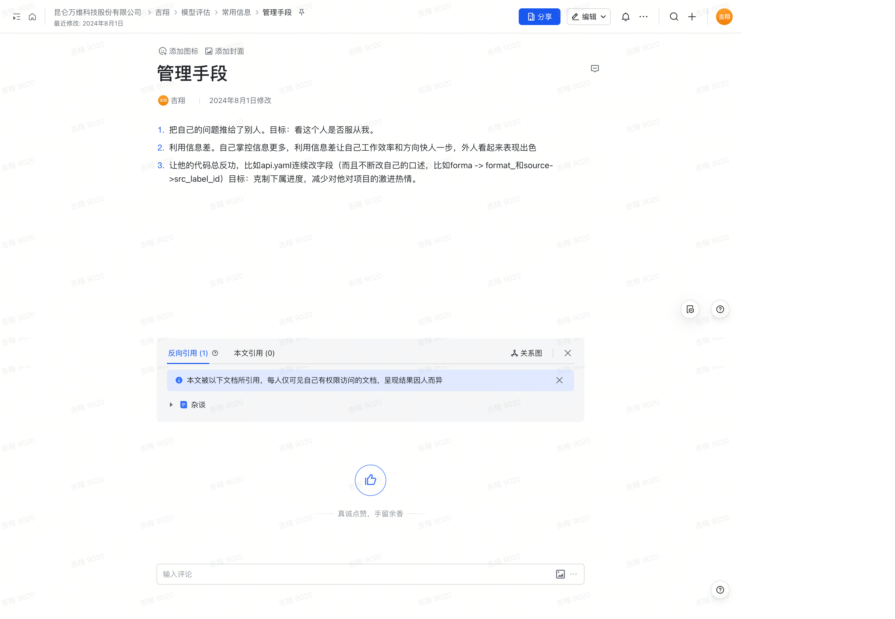

## 管理手段

1. **把自己的问题推给了别人**  
   - **目标**：看这个人是否服从我。

2. **利用信息差**  
   - **目的**：自己掌控更多的信息，利用信息差让自己在工作上效率和方向领先他人，外人看起来表现出色。

3. **让他的代码总反功**  
   - **方法**：通过在 `api.yaml` 中连续改字段（如不断改动自己的口述，比如 `forma` -> `format_` 和 `source` -> `src_label_id`）。  
   - **目标**：克制下属的进度，减少他们对项目的激进热情。

原始文档截图：

